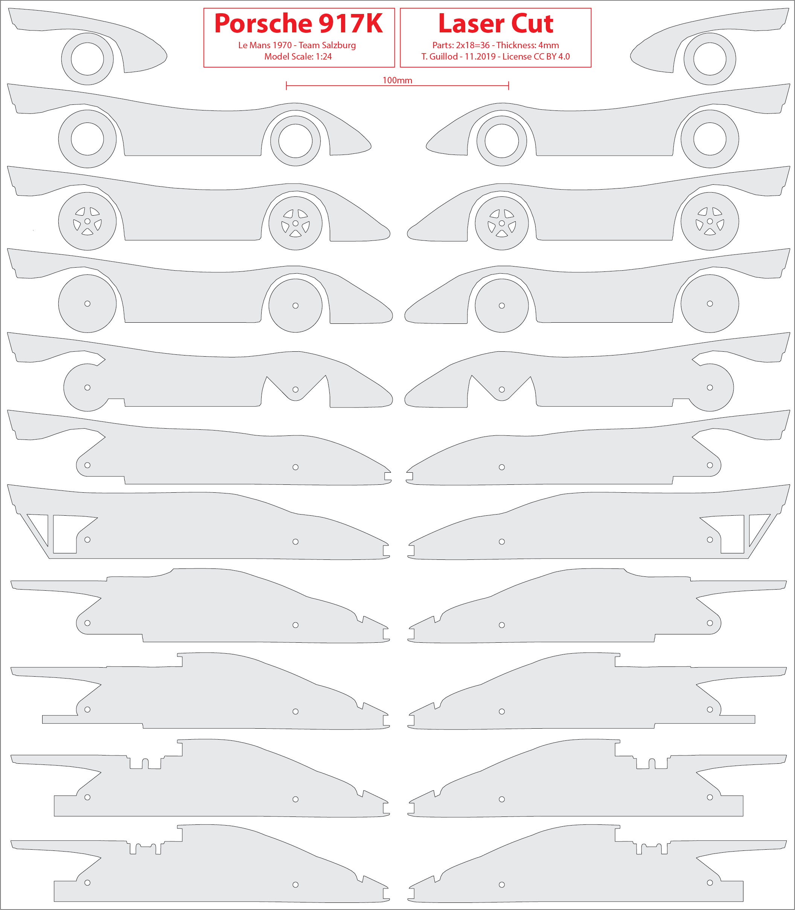

# Laser Cut Slicer in MATLAB / Porsche 917K

This **MATLAB** code helps you to realize a 3d object with **stacked laser cut plates**:
* Extract the **interesection** of a 3d STL object and a **cut plane**, visualize, and export the results as PDF.
* Create **3d meshed parts from 2d parts**, assemble the plates into a **3d contruction**, and visualize.

The example provided with the code is a **Porsche 917K racecar**.

    
    
    

If you are just interested by building the Porsche 917K, you just need [Porsche_917K.pdf](Porsche_917K.pdf) and [Porsche_917K.stl](Porsche_917K.stl).

## Workflow

First take the STL file, define cut planes, and visualize the contours (with the provided MATLAB tool).

    

Then export the contour as PDF (with the provided MATLAB tool).

    

With a vector graphic tool, edit, simplify, and improve the contour.
Export the results as bitmap raster, which each layer represents its own file.
Bitmap format is used for compatibly, simplicity, and robustness.

    

Transform the bitmap raster into a full 3d construction (with the provided MATLAB tool).

    
    
    

With a vector graphic tool, edit the final version for laser cutting.

    

With some patience (and some glue), assemble the model!

## Porsche 917K

The example model is a **Porsche 917K**, one of the most iconic racecar ever produced.
As a typical racecar from the end of 60s, many versions were produced.
The version used for the sliced model is the car used by Team Salzburg in Le Mans 1970 (winner, car 23).

    
    

The sliced model is at the **1:24 scale**. The model contains **2x18=36 parts** and the plate thickness is 4mm.
Of course, the model car be scaled to be smaller. A larger model will probably look too coarse.

## More Info

For the technical info about the workflow and the code, please read [source_code/README.txt](source_code/README.txt).

## But I don't have MATLAB

I have used MATLAB since it has many functions for meshing and image handling.
Moreover, this code is a quick and dirty personal project.
However, tell me if you are interested by a Python implementation.
Then, I might make a version using numpy/matplotlib, opencv/shapely, and triangle/openmesh.

## Author

**Thomas Guillod** - [GitHub Profile](https://github.com/otvam)

## License

This project is licensed under the **BSD License**, see [LICENSE.md](LICENSE.md).
